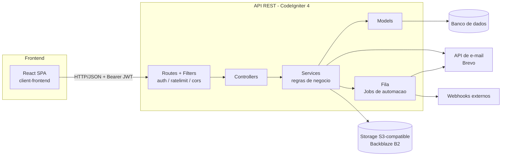
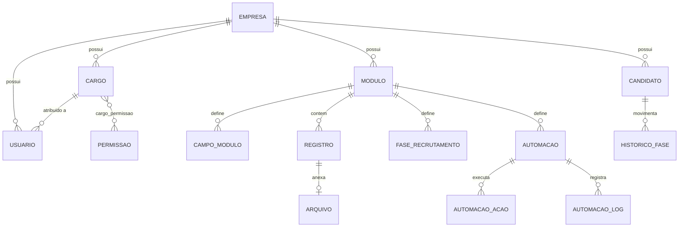

# Levit

Plataforma SaaS multi-tenant para criação de módulos de dados sob medida, com um módulo especializado de recrutamento (ATS) em formato Kanban.

O repositório é um monorepo simples com dois projetos independentes:

- **`api-backend/`** — API REST em PHP (CodeIgniter 4)
- **`client-frontend/`** — SPA em React (Vite)

---

## Sumário

- [Visão geral](#visão-geral)
- [Funcionalidades](#funcionalidades)
- [Tecnologias](#tecnologias)
- [Arquitetura](#arquitetura)
- [Estrutura do projeto](#estrutura-do-projeto)
- [Requisitos](#requisitos)
- [Instalação](#instalação)
- [Configuração](#configuração)
- [Banco de dados](#banco-de-dados)
- [Execução](#execução)
- [Testes](#testes)
- [API](#api)
- [Autenticação e autorização](#autenticação-e-autorização)
- [Segurança](#segurança)
- [Deploy](#deploy)
- [Limitações conhecidas](#limitações-conhecidas)
- [Licença](#licença)

---

## Visão geral

Cada empresa (`empresa`) que se cadastra na plataforma pode criar **módulos** próprios para organizar dados internos. Um módulo é uma entidade genérica e configurável pelo usuário, com três tipos possíveis:

- `dados` — módulo genérico com campos customizados (`campo_modulo`) e registros (`registro`) armazenados como JSON;
- `arquivo` — módulo voltado ao armazenamento de arquivos, com upload para um provedor compatível com S3;
- `recrutamento` — módulo especializado em vagas, com um Kanban de fases (`fase_recrutamento`) e um formulário público de candidatura para captar candidatos (`candidato`) sem exigir login.

Além disso, a plataforma oferece controle de equipe com cargos e permissões por empresa, automações disparadas por eventos em registros (envio de e-mail ou webhook) e rotinas de backup/exportação dos dados da empresa.

## Funcionalidades

- **Autenticação**: cadastro (`AuthController::registrar`, que cria a empresa e o usuário fundador), login e logout com revogação de token (`token_revogado`), recuperação e redefinição de senha.
- **Módulos customizados**: criação, edição e exclusão de módulos, com campos configuráveis e reordenação de campos.
- **Registros**: CRUD de registros dentro de um módulo, com dados armazenados em coluna JSON (`registro.dados`).
- **Upload de arquivos**: envio, download e exclusão de arquivos vinculados a um registro, armazenados em um serviço externo compatível com S3.
- **Recrutamento (Kanban)**: fases de recrutamento configuráveis por módulo, formulário público de candidatura com limitação de taxa (rate limit), quadro Kanban (por módulo e global), movimentação de candidatos entre fases com histórico (`historico_fase`).
- **Gestão de equipe**: convite de membros por e-mail, aceite de convite, listagem e remoção de membros, cargos (`cargo`) com permissões granulares (`permissao` / `cargo_permissao`).
- **Automações**: regras por módulo, disparadas por gatilhos em registros, com condições e ações encadeadas (`enviar_email` ou `webhook`), processadas de forma assíncrona via fila (`AutomacaoJob`/`ProcessarAutomacoes`) e registradas em log (`automacao_log`).
- **Backup e exportação**: exportação de todos os dados da empresa em JSON, exportação de um módulo específico em CSV, e reset de fábrica dos dados da empresa.

## Tecnologias

| Categoria             | Tecnologia                                             |
| ---------------------- | ------------------------------------------------------- |
| Linguagem (backend)     | PHP `^8.2`                                              |
| Framework (backend)     | CodeIgniter `^4.7`                                       |
| Autenticação             | `firebase/php-jwt ^7.1` (JWT)                           |
| Fila / jobs assíncronos  | `codeigniter4/queue ^1.0`                               |
| Armazenamento de arquivos | `aws/aws-sdk-php ^3.392` (Backblaze B2)                 |
| Envio de e-mail          | Integração HTTP com a API da Brevo (via Guzzle)          |
| Testes (backend)         | PHPUnit `^10.5`                                          |
| Linguagem (frontend)     | JavaScript (React `^19.2`)                               |
| Build tool (frontend)    | Vite `^8.2`                                              |
| Roteamento (frontend)    | React Router `^7.18`                                     |
| HTTP client (frontend)   | Axios `^1.19`                                            |
| Estilos (frontend)       | Tailwind CSS `^4.3`                                       |
| Lint (frontend)          | ESLint `^10.8`                                            |

O SGBD (banco de dados) não pôde ser confirmado com certeza — ver seção [Banco de dados](#banco-de-dados).

## Arquitetura

O backend segue a organização convencional do CodeIgniter 4 (MVC), com uma camada adicional de **serviços** concentrando as regras de negócio, os controllers (`app/Controllers`) delegam para classes em `app/Services`, que por sua vez usam os models (`app/Models`) para acesso a dados. Autenticação e autorização são resolvidas em um filtro de rota (`app/Filters/AuthFilter.php`), aplicado por grupo de permissão diretamente na definição de cada rota.



## Estrutura do projeto

```text
Levit-dev-caua/
├── api-backend/
│   ├── app/
│   │   ├── Controllers/     # Endpoints da API (auth, modulos, registros, candidatos...)
│   │   ├── Services/        # Regras de negocio (um servico por dominio)
│   │   ├── Models/          # Acesso a dados (um model por tabela)
│   │   ├── Filters/         # AuthFilter (JWT) e RateLimitFilter
│   │   ├── Jobs/            # Job de processamento de automacoes (fila)
│   │   ├── Database/
│   │   │   ├── Migrations/  # 26 migrations
│   │   │   └── Seeds/       # PermissaoSeeder
│   │   ├── Config/          # Configuracao do framework (rotas, CORS, filtros, fila...)
│   │   └── Helpers/         # uuid_helper.php
│   ├── tests/                # Testes de exemplo do CodeIgniter (ver secao Testes)
│   ├── public/                # Document root (index.php)
│   └── composer.json
└── client-frontend/
    ├── src/
    │   ├── pages/            # Login, Register, Dashboard, Modules, RecrutamentoKanban, TeamManagement...
    │   ├── components/        # Layout, ProtectedRoute
    │   ├── context/           # AuthContext
    │   └── services/          # Clientes Axios por dominio (moduloService, equipeService...)
    └── package.json
```

## Requisitos

- PHP `>= 8.2`, com as extensões exigidas pelo CodeIgniter 4 (`intl`, `mbstring`, entre outras do próprio framework)
- [Composer](https://getcomposer.org/)
- Node.js, o Vite 8 exige Node.js `20.19+` ou `22.12+`
- npm (ou outro gerenciador de pacotes compatível com o `package-lock.json`)
- Um banco de dados relacional configurado via variáveis de ambiente (ver [Banco de dados](#banco-de-dados))
- Conta/credenciais em um provedor de e-mail (Brevo) e em um serviço de armazenamento compatível com S3 (Backblaze B2)

## Instalação

### 1. Clone o repositório

```bash
git clone <url-do-repositorio>
cd Levit
```

### 2. Backend — instale as dependências

```bash
cd api-backend
composer install
```

### 3. Backend — configure as variáveis de ambiente

O projeto **não inclui** um arquivo `.env` ou `.env.example` na raiz do `api-backend`. É necessário criar manualmente um arquivo `.env` com, no mínimo, as variáveis listadas em [Configuração](#configuração).

> O próprio `README.md` padrão do CodeIgniter (mantido em `api-backend/README.md`) instrui a copiar um arquivo chamado `env` para `.env`, mas esse arquivo não está presente no projeto enviado.

### 4. Backend — configure o banco de dados

Defina as credenciais de conexão no `.env` (ver [Banco de dados](#banco-de-dados)) e então execute as migrations e o seed de permissões:

```bash
php spark migrate
php spark db:seed PermissaoSeeder
```

### 5. Frontend — instale as dependências

```bash
cd ../client-frontend
npm install
```

## Configuração

### Backend

As seguintes variáveis de ambiente são lidas diretamente no código (via `env()`):

| Variável                 | Finalidade                                              | Obrigatória |
| ------------------------- | --------------------------------------------------------- | :---------: |
| `JWT_SECRET_KEY`           | Chave usada para assinar e validar os tokens JWT           | Sim¹        |
| `EMAIL_PROVIDER`           | Seleciona o provedor de e-mail (`brevo` ou `log`); padrão `brevo` | Não        |
| `BREVO_API_KEY`             | Chave de API da Brevo, usada quando `EMAIL_PROVIDER=brevo` | Condicional |
| `BREVO_REMETENTE_EMAIL`     | E-mail do remetente nas mensagens enviadas                  | Condicional |
| `BREVO_REMETENTE_NOME`      | Nome do remetente (padrão: `Levit`)                          | Não        |
| `B2_BUCKET`                 | Bucket do storage compatível com S3                         | Sim         |
| `B2_REGION`                 | Região do storage                                            | Sim         |
| `B2_ENDPOINT`               | Endpoint do storage (sem `https://`, adicionado pelo código) | Sim         |
| `B2_KEY_ID`                  | Chave de acesso do storage                                   | Sim         |
| `B2_APPLICATION_KEY`         | Segredo da chave de acesso do storage                        | Sim         |

Além dessas, o CodeIgniter 4 usa por convenção variáveis de configuração do framework no mesmo `.env`, entre elas `app.baseURL` e o grupo `database.default.*` (`hostname`, `username`, `password`, `database`, `port`), já que `app/Config/Database.php` não traz nenhuma credencial hardcoded.

¹ Se `JWT_SECRET_KEY` não for definida, o código aplica um valor padrão fixo embutido no repositório, ver [Segurança](#segurança). Configurá-la é obrigatório para qualquer ambiente que não seja desenvolvimento local isolado.

**Nenhum valor de segredo ou credencial foi reproduzido neste README.**

### Frontend

O front-end **não usa variáveis de ambiente**. A URL base da API está definida diretamente no código-fonte, em `client-frontend/src/services/api.js`:

```js
const API_BASE_URL = 'http://localhost:8080/api/v1';
```

Para apontar o front-end para uma API em outro endereço, é necessário editar esse valor diretamente no arquivo (não há suporte a `.env`/`import.meta.env` no projeto atual).

## Banco de dados

- `app/Config/Database.php` define o driver padrão (`$default['DBDriver']`) como `MySQLi`, na porta `3306`, sem nenhuma credencial preenchida (valores vazios, a serem sobrescritos por `.env`).
- Porém, as 26 migrations usam consistentemente `RawSql('uuidv7()')` como valor padrão de chave primária e ao menos uma migration insere dados com a função SQL `uuidv7()` diretamente (`INSERT INTO permissao (...) VALUES (uuidv7(), ...)`), além de uma coluna `jsonb` (tipo nativo do PostgreSQL) na tabela `campo_modulo`.

`uuidv7()` como função nativa e o tipo `jsonb` são recursos específicos do **PostgreSQL**, incompatíveis com o driver `MySQLi` configurado por padrão. Isso significa que o ambiente real de desenvolvimento/produção usa PostgreSQL com a configuração de driver sobrescrita via `.env`.

O schema principal, conforme as migrations, contempla 17 tabelas. As relações centrais:



As demais tabelas nas migrations são: `token_revogado`, `convite`.

Para popular as permissões padrão do sistema, execute o seeder após as migrations (comando na seção [Instalação](#instalação)):

```text
gerenciar_modulos, gerenciar_equipe, gerenciar_recrutamento, ver_relatorios, gerenciar_automacoes, gerenciar_dados
```

## Execução

### Backend (desenvolvimento)

```bash
cd api-backend
php spark serve
```

Por padrão, a aplicação sobe em `http://localhost:8080/`, conforme `$baseURL` definido em `app/Config/App.php`.

Para processar a fila de automações (jobs assíncronos), é necessário rodar o worker da fila do CodeIgniter separadamente:

```bash
php spark queue:work
```

O comando exato do worker não foi testado neste projeto; ele segue a convenção padrão do pacote `codeigniter4/queue`, configurado em `app/Config/Queue.php` com handler padrão `database`.

### Frontend (desenvolvimento)

```bash
cd client-frontend
npm run dev
```

O Vite inicia o servidor de desenvolvimento com hot-reload (porta padrão do Vite, não sobrescrita em `vite.config.js`).

### Build de produção do frontend

```bash
npm run build
npm run preview   # para pré-visualizar o build localmente
```

## Testes

### Backend

O projeto usa PHPUnit, configurado em `phpunit.dist.xml`:

```bash
cd api-backend
composer test
# ou diretamente:
vendor/bin/phpunit
```

Os arquivos de teste (`tests/unit/HealthTest.php`, `tests/database/ExampleDatabaseTest.php`, `tests/session/ExampleSessionTest.php`) são os testes de exemplo padrão que acompanham o starter do CodeIgniter 4. Não possui testes automatizados cobrindo a lógica de negócio própria da aplicação (controllers, services ou models customizados).

### Frontend

Não possui dependências ou scripts de teste (Jest, Vitest, Testing Library etc.) no `package.json` do `client-frontend`.

## API

Todas as rotas ficam sob o prefixo `api/v1` (definidas em `app/Config/Routes.php`). Respostas seguem um envelope padrão (`app/Controllers/BaseApiController.php`):

```json
{ "status": "success", "data": { } }
```
```json
{ "status": "error", "message": "...", "errors": { } }
```

### Autenticação

| Método | Endpoint             | Descrição                          | Autenticação |
| ------ | --------------------- | ------------------------------------ | :-----------: |
| POST   | `auth/registrar`        | Cadastra empresa + usuário fundador   | —             |
| POST   | `auth/login`             | Autentica e retorna o token JWT       | —             |
| POST   | `auth/logout`            | Revoga o token atual                  | JWT           |

### Módulos, campos e registros

| Método | Endpoint                                    | Descrição                              |
| ------ | ---------------------------------------------| ----------------------------------------- |
| GET    | `modulos`                                     | Lista os módulos da empresa                |
| POST   | `modulos`                                     | Cria um módulo                             |
| GET    | `modulos/{uuid}`                               | Detalhes de um módulo                       |
| PUT    | `modulos/{uuid}`                               | Atualiza um módulo                          |
| DELETE | `modulos/{uuid}`                               | Exclui um módulo                            |
| POST   | `modulos/{uuid}/campos`                         | Adiciona um campo ao módulo                 |
| PUT    | `modulos/{uuid}/campos/reordenar`                | Reordena campos                             |
| PUT    | `modulos/{uuid}/campos/{uuid}`                   | Atualiza um campo                           |
| DELETE | `modulos/{uuid}/campos/{uuid}`                   | Exclui um campo                             |
| GET    | `modulos/{uuid}/registros`                       | Lista registros do módulo                   |
| POST   | `modulos/{uuid}/registros`                       | Cria um registro                            |
| PUT    | `modulos/{uuid}/registros/{uuid}`                 | Atualiza um registro                        |
| DELETE | `modulos/{uuid}/registros/{uuid}`                 | Exclui um registro                          |

### Arquivos

| Método | Endpoint                                     | Descrição              |
| ------ | ----------------------------------------------| ------------------------- |
| POST   | `modulos/{uuid}/arquivos`                       | Envia um arquivo          |
| GET    | `modulos/{uuid}/arquivos/{uuid}`                 | Baixa um arquivo          |
| DELETE | `modulos/{uuid}/arquivos/{uuid}`                 | Exclui um arquivo         |

### Recrutamento

| Método | Endpoint                                              | Descrição                              | Autenticação |
| ------ | -------------------------------------------------------| ----------------------------------------- | :-----------: |
| POST   | `publico/candidatura/{uuid}`                             | Envia uma candidatura (formulário público) | Rate limit apenas |
| GET    | `modulos/{uuid}/kanban`                                    | Kanban de candidatos de um módulo          | JWT           |
| GET    | `modulos/{uuid}/candidatos/{uuid}`                          | Detalhes de um candidato                   | JWT           |
| PUT    | `modulos/{uuid}/candidatos/{uuid}/fase`                     | Move o candidato de fase                   | JWT           |
| GET    | `recrutamento/kanban`                                        | Kanban global (todos os módulos)           | JWT           |
| PUT    | `recrutamento/candidatos/{uuid}/fase`                        | Move candidato de fase (Kanban global)      | JWT           |
| DELETE | `modulos/{uuid}/candidatos/{uuid}`                          | Exclui um candidato                        | JWT (`gerenciar_recrutamento`) |
| POST   | `modulos/{uuid}/fases`                                        | Cria fase de recrutamento                   | JWT (`gerenciar_modulos`) |
| PUT    | `modulos/{uuid}/fases/reordenar`                              | Reordena fases                              | JWT (`gerenciar_modulos`) |
| PUT    | `modulos/{uuid}/fases/{uuid}`                                | Atualiza fase                               | JWT (`gerenciar_modulos`) |
| DELETE | `modulos/{uuid}/fases/{uuid}`                                | Exclui fase                                 | JWT (`gerenciar_modulos`) |

### Equipe, cargos e automações

| Método | Endpoint                                      | Descrição                       |
| ------ | ------------------------------------------------| ---------------------------------- |
| GET    | `cargos`                                          | Lista cargos                        |
| POST   | `cargos`                                          | Cria cargo                          |
| POST   | `equipe/convidar`                                  | Convida um membro por e-mail        |
| GET    | `equipe`                                            | Lista membros da equipe             |
| DELETE | `equipe/{uuid}`                                    | Remove um membro                    |
| POST   | `publico/convite/aceitar`                            | Aceita um convite (público)         |
| POST   | `modulos/{uuid}/automacoes`                          | Cria automação                      |
| GET    | `modulos/{uuid}/automacoes`                          | Lista automações                    |
| PUT    | `modulos/{uuid}/automacoes/{uuid}/ativo`               | Ativa/desativa automação            |
| DELETE | `modulos/{uuid}/automacoes/{uuid}`                    | Exclui automação                    |

### Backup

| Método | Endpoint                          | Descrição                                       |
| ------ | ------------------------------------| -------------------------------------------------- |
| GET    | `backup/json`                        | Exporta todos os dados da empresa em JSON            |
| GET    | `modulos/{uuid}/exportar-csv`          | Exporta os registros de um módulo em CSV             |
| POST   | `backup/resetar`                     | Reseta os dados da empresa (irreversível)             |

## Autenticação e autorização

- **Autenticação**: baseada em JWT (`firebase/php-jwt`), enviado no header `Authorization: Bearer <token>`. A validação, incluindo checagem de revogação (`token_revogado`), acontece em `app/Filters/AuthFilter.php`.
- **Autorização**: RBAC simples por empresa. Cada usuário tem um `cargo`, e cada `cargo` tem uma lista de `permissao` associada via `cargo_permissao`. As rotas que exigem uma permissão específica declaram isso diretamente no arquivo de rotas, por exemplo `['filter' => 'auth:gerenciar_modulos']`.
- **Rate limiting**: aplicado especificamente às rotas públicas (`publico/candidatura/{uuid}` e `publico/convite/aceitar`) via `app/Filters/RateLimitFilter.php`, limitando a 5 tentativas por hora por endereço IP.
- No front-end, o token é armazenado em `localStorage` (chave `levit_token`) e injetado automaticamente em toda requisição Axios; um interceptor trata respostas `401` limpando o storage e redirecionando para `/login`.

## Segurança

- Senhas de usuário são armazenadas como hash (coluna `senha_hash`); a implementação exata do hashing não foi inspecionada em detalhe aqui.
- Validação de entrada nos controllers via as regras de validação nativas do CodeIgniter (`required`, `valid_email`, `min_length`, `regex_match` etc.).
- Rate limiting nas rotas públicas sensíveis a abuso (candidatura e aceite de convite).
- CORS configurado via `app/Config/Cors.php` e filtro `cors`.

Pontos de atenção:

- `app/Services/JwtService.php` define um valor padrão fixo para `JWT_SECRET_KEY` caso a variável de ambiente não esteja definida. Isso significa que, se o `.env` não for configurado corretamente em produção, a assinatura dos tokens pode usar uma chave previsível e conhecida por qualquer pessoa com acesso ao código-fonte.
- `app/Services/Storage/BackblazeStorageService.php` instancia o cliente S3 com verificação de certificado TLS desabilitada (`'verify' => false`).
- `app/Config/Cors.php` mantém `allowedOrigins` como `['*']` (valor padrão do framework, não restrito a domínios específicos).
- O JWT é armazenado em `localStorage` no front-end, o que expõe o token a riscos de XSS caso exista alguma vulnerabilidade de injeção de script na aplicação.

## Limitações conhecidas

- Inconsistência entre o driver de banco de dados configurado por padrão (`MySQLi`) e o uso de recursos específicos do PostgreSQL nas migrations (`uuidv7()`, `jsonb`), ver [Banco de dados](#banco-de-dados).
- Não há arquivo `.env`/`.env.example` no repositório, o que obriga quem for configurar o projeto a descobrir as variáveis necessárias diretamente no código-fonte.
- Não foram identificados testes automatizados cobrindo a lógica de negócio da aplicação, nem no backend nem no front-end.
- Não há pipeline de CI/CD configurado.
- O arquivo `api-backend/test_db.php`, presente na raiz do backend, contém um trecho de PHP malformado (variáveis com `\` em vez de `$`) e não é executável no estado atual.
- URL base da API fixada diretamente no código do front-end (`client-frontend/src/services/api.js`), sem suporte a variáveis de ambiente para trocar de ambiente (dev/staging/produção).

## Diagnóstico da análise

### Pontos fortes identificados

- Separação clara de responsabilidades no backend (Controller → Service → Model), com uma camada de serviço consistente para cada domínio.
- Autorização baseada em permissões granulares por cargo, aplicada diretamente na definição das rotas — fácil de auditar.
- Uso de UUID (v7) como chave primária em todas as tabelas, o que favorece escalabilidade horizontal e evita previsibilidade de IDs sequenciais.
- Abstrações por interface para os serviços externos (`EmailServiceInterface`, `StorageServiceInterface`), o que facilita trocar provedores.
- Processamento assíncrono de automações via fila, evitando bloquear a requisição HTTP original.
- Rate limiting aplicado especificamente onde há maior risco de abuso (endpoints públicos sem autenticação).

### Informações que não puderam ser confirmadas

- O SGBD real de destino (MySQL, conforme configuração padrão, ou PostgreSQL, conforme uso de `uuidv7()`/`jsonb` nas migrations).
- Versão exata do Node.js exigida pelo projeto (não declarada em `package.json`; inferida apenas a partir do requisito oficial do Vite 8).
- Se o `LICENSE` (MIT) encontrado em `api-backend/` se aplica ao código de aplicação além do starter do framework.
- Processo e ambiente de deploy (não há artefatos de infraestrutura no repositório).
- Algoritmo exato de hashing de senha usado (não inspecionado em profundidade neste diagnóstico).
- Nome oficial do produto (inferido por convenção de nomes no código, não declarado explicitamente).

### Problemas encontrados no projeto que afetam a documentação

- Ausência de `.env.example`, que é a fonte mais comum de verdade sobre variáveis de ambiente exigidas — a lista de variáveis deste README foi reconstruída por busca textual no código-fonte e pode não cobrir 100% dos casos.
- README padrão (não customizado) tanto no backend quanto no frontend, sem nenhuma documentação própria prévia para servir de referência cruzada.
- Ausência de testes de negócio dificulta descrever o comportamento esperado da API com total segurança apenas pela leitura do código.

### Melhorias recomendadas

- Adicionar um `.env.example` documentando todas as variáveis necessárias (backend) e, idealmente, migrar a URL base da API do frontend para uma variável `VITE_API_BASE_URL`.
- Resolver a inconsistência de driver de banco de dados: se o alvo é PostgreSQL, atualizar `app/Config/Database.php` para refletir isso; se é MySQL, revisar as migrations que usam `uuidv7()`/`jsonb`.
- Remover o valor padrão fixo de `JWT_SECRET_KEY` em `JwtService.php`, exigindo a variável de ambiente e falhando de forma explícita se ausente.
- Reativar a verificação de certificado TLS no cliente do serviço de armazenamento.
- Adicionar testes automatizados cobrindo as regras de negócio dos `Services`, tanto no backend quanto no frontend.
- Declarar explicitamente a licença do projeto na raiz do repositório, cobrindo os dois subprojetos.
